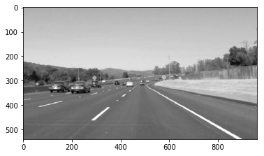
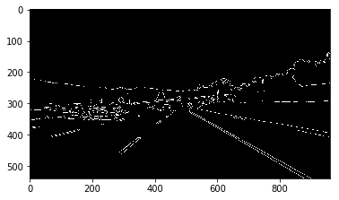
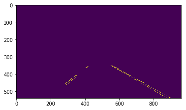
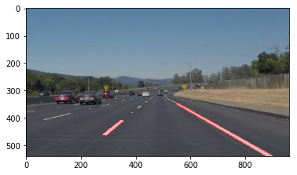

#**Finding Lane Lines on the Road** 

##Writeup Template

###You can use this file as a template for your writeup if you want to submit it as a markdown file. But feel free to use some other method and submit a pdf if you prefer.

---

**Finding Lane Lines on the Road**

The goals / steps of this project are the following:
* Make a pipeline that finds lane lines on the road
* Reflect on your work in a written report

[//]: # (Image References)

[image1]: ./examples/grayscale.jpg "Grayscale"

---

### Reflection

###1. Describe your pipeline. As part of the description, explain how you modified the draw_lines() function.

My pipeline consisted of 5 steps:

- I converted the image to grayscale

- Apply Gaussian smoothing/blurring

- Next I applied Canny function to get the edges in the image

- Define a region of interest

- Last step is detect lines with Hough function and draw the lines over the original image

In order to draw a single line on the left and right lanes, I modified the draw_lines() function by ...

###2. Identify potential shortcomings with your current pipeline

One shortcoming that I saw in my solution is that sometimes horizontal lines are being detected. 

###3. Suggest possible improvements to your pipeline

An improvement for my solution would be discard detected lines that are horizontal, or pretty close to a horizontal line.
