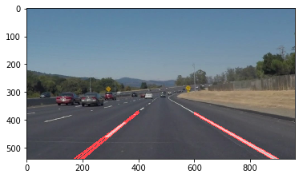

#**Finding Lane Lines on the Road** 

##Writeup Template

###You can use this file as a template for your writeup if you want to submit it as a markdown file. But feel free to use some other method and submit a pdf if you prefer.

---

**Finding Lane Lines on the Road**

The goals / steps of this project are the following:
* Make a pipeline that finds lane lines on the road
* Reflect on your work in a written report

[//]: # (Image References)

[image1]: ./examples/grayscale.jpg "Grayscale"

---

### Reflection

###1. Describe your pipeline. As part of the description, explain how you modified the draw_lines() function.

My pipeline consisted of 5 steps:

- I converted the image to grayscale

- Apply Gaussian smoothing/blurring

- Next I applied Canny function to get the edges in the image

- Define a region of interest

- Last step is detect lines with Hough function and draw the lines over the original image

In order to draw a single line on the left and right lanes, I modified the draw_lines() function by calculating the slope and the y-intercept. Once I have both values I can interpolate any value following the formula: `y = mx + b`
When getting the slope, we divide the lines in right (if value is positive) and left (if value is negative). Then calculate the value of `y` for the max and min values of `x` that defined previously in the region of interest.
The result is the following:

###2. Identify potential shortcomings with your current pipeline

One shortcoming that I saw in my solution is that sometimes horizontal lines are being detected. 
Another problem is that several lines are being drawn when I have segmented lines. 

###3. Suggest possible improvements to your pipeline

An improvement for my solution would be discard detected lines that are horizontal, or pretty close to a horizontal line.
To improve the look of the extended segmented lines, could be draw just one line for each side of the lane. So, the idea will be to merge somehow the lines detected for each side, and draw just one for each side.
